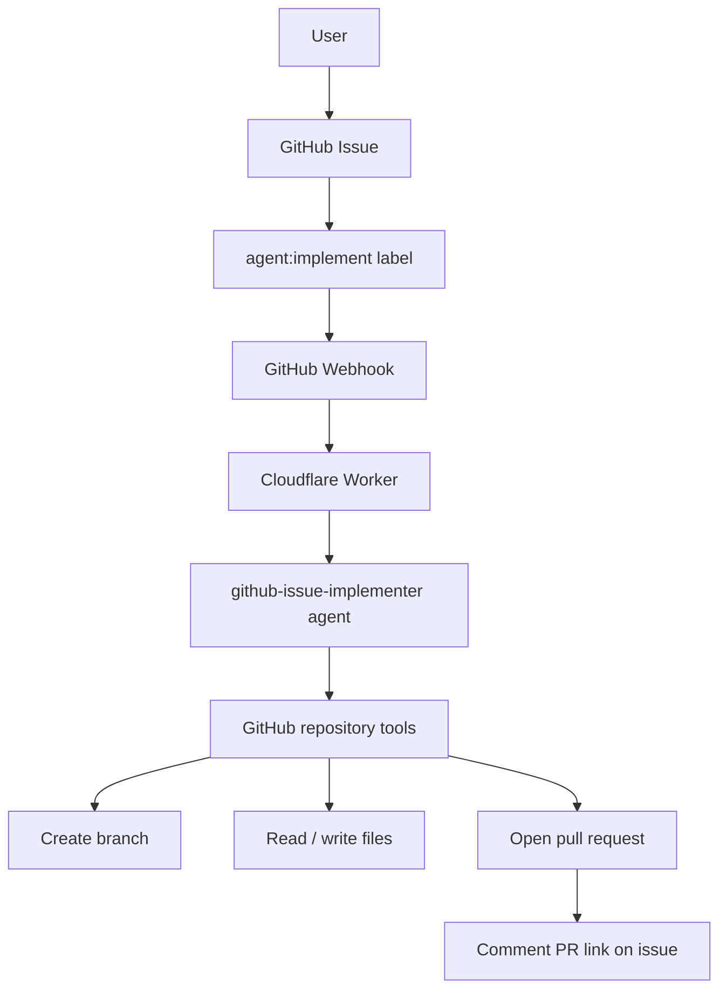

# GitHub Issue to PR Agent Design

## 背景

前案では Discord など外部チャットから実装依頼を受ける構成を考えました。しかし、この repository にはすでに GitHub webhook、issue triage agent、PR review agent があります。

そのため初期版は、Discord を追加せず、GitHub issue から実装依頼を投げられる構成にします。入口を GitHub issue に寄せることで、追加アカウント、slash command 登録、Discord interaction endpoint、bot 権限を不要にできます。

## 目的

GitHub issue に実装依頼を書き、特定 label を付けると、Flue agent が repository を読み、専用 branch に変更を作り、pull request を開くようにします。

対象 repository は初期版では固定します。

```text
t-nakatani/flue-framework
```

## 作るもの

- GitHub issue webhook からの実装依頼検出
- 実装依頼用 label
- Flue addressable agent `github-issue-implementer`
- GitHub API を使う repository edit tools
- 実装 branch の作成
- 許可された file の作成・更新
- Pull request の作成
- 元 issue への PR link コメント

## 作らないもの

初期版では、次は作りません。

- Discord / Slack / LINE などの外部チャット連携
- 任意 repository への実装
- `main` への直接 push
- shell 実行や任意コマンド実行
- secret や `.env` の編集
- 依存追加を含む大きな変更
- 複数 PR をまたぐ大規模リファクタ
- CI failure を見て自動修正し続ける loop

## 使い方

1. GitHub issue を作る。
2. issue body に実装依頼を書く。
3. `agent:implement` label を付ける。
4. webhook が Cloudflare Worker に届く。
5. Worker が `github-issue-implementer` agent を dispatch する。
6. agent が branch を作り、変更を commit し、PR を作る。
7. agent が元 issue に PR link をコメントする。

例:

```markdown
## 実装依頼

study/ に Flue の channel 概念を説明する章を追加してください。

## 期待する変更

- `study/05-channels.md` を追加
- `study/README.md` の学習順に追記
- GitHub webhook と Discord channel の違いも軽く触れる
```

label:

```text
agent:implement
```

## 全体アーキテクチャ



## Webhook Trigger

既存の GitHub webhook を使います。

対象 event:

- `issues`

起動条件:

- `action` が `opened`, `edited`, `labeled`, `reopened` のいずれか
- issue に `agent:implement` label が付いている
- issue が pull request ではない
- issue body が空ではない

二重起動防止:

- issue に `agent:in-progress` label を付ける
- PR 作成後に `agent:pr-opened` label を付ける
- `agent:pr-opened` がある issue は再実行しない

失敗時:

- `agent:failed` label を付ける
- issue comment に失敗理由を短く残す

## Agent の責務

`github-issue-implementer` は、issue に書かれた自然言語の実装依頼を GitHub PR に変換する agent です。

責務:

- issue title / body / labels を読む
- 依頼内容を小さな実装単位に整理する
- repository tree から変更対象を探す
- 必要な file を読む
- 既存の設計、README、example の構成に合わせる
- 専用 branch を作る
- 許可された path の file だけ作成・更新する
- PR を作る
- 元 issue に PR link と変更概要をコメントする

禁止:

- `main` branch へ直接書く
- secret を出力、保存、変更する
- `.env`, `.dev.vars`, `.git`, `node_modules`, `dist`, `.wrangler` を変更する
- command 実行権限を持つ tool を使う
- 不明点が大きいまま大規模変更を進める

## GitHub Tools

初期版では Cloudflare Worker から GitHub API を呼びます。local clone や shell は使いません。

必要な tool:

| Tool | 用途 |
| --- | --- |
| `get_repository_tree` | 対象 repository の file tree を取得する |
| `read_repository_file` | base branch または作業 branch の file content を読む |
| `create_implementation_branch` | base branch から作業 branch を作る |
| `write_file_to_branch` | 作業 branch 上の file を作成・更新する |
| `create_pull_request` | 作業 branch から PR を作る |
| `comment_on_issue` | 元 issue に結果をコメントする |
| `update_issue_labels` | 進行状況 label を更新する |

## Branch Policy

作業 branch は固定 prefix を使います。

```text
issue-implement/
```

例:

```text
issue-implement/1-add-channel-study
```

tool 側で branch name を検査し、この prefix 以外には書き込めないようにします。

## Path Policy

書き込み禁止 path:

```text
.git/
.env
.env.*
.dev.vars
.dev.vars.*
node_modules/
dist/
.wrangler/
package-lock.json
```

初期版では `package-lock.json` の更新も禁止します。依存追加が必要な依頼は、agent が PR body または issue comment に「人間の確認が必要」として残します。

書き込み上限:

- 1 issue あたり最大 5 files
- 1 file あたり最大 200 KB
- binary file は禁止

## Labels

使う label:

| Label | 意味 |
| --- | --- |
| `agent:implement` | 実装依頼として agent を起動する |
| `agent:in-progress` | agent が処理中 |
| `agent:pr-opened` | PR 作成済み |
| `agent:failed` | agent 実行失敗 |
| `agent:needs-human` | 依頼が大きすぎる、曖昧、または権限外 |

## 必要な設定

追加アカウントは不要です。既存の Cloudflare、GitHub、OpenRouter を使います。

Cloudflare secrets:

```env
OPENROUTER_API_KEY="..."
GITHUB_TOKEN="..."
GITHUB_WEBHOOK_SECRET="..."
```

Cloudflare vars:

```env
IMPLEMENTATION_REPO_OWNER="t-nakatani"
IMPLEMENTATION_REPO_NAME="flue-framework"
IMPLEMENTATION_BASE_BRANCH="main"
IMPLEMENTATION_BRANCH_PREFIX="issue-implement/"
IMPLEMENTATION_TRIGGER_LABEL="agent:implement"
IMPLEMENTATION_MAX_FILE_WRITES="5"
FLUE_REPO_IMPLEMENTATION_MODEL="openrouter/nvidia/nemotron-3-ultra-550b-a55b:free"
```

## GitHub Token 権限

fine-grained personal access token の最小権限:

- Repository access: `t-nakatani/flue-framework` のみに限定
- Metadata: read
- Contents: read/write
- Issues: read/write
- Pull requests: read/write

## Model

ユーザー方針に合わせ、OpenRouter の無料 model を使います。

現在の本番設定では、無料枠で動いた実績がある次を使います。

```text
openrouter/nvidia/nemotron-3-ultra-550b-a55b:free
```

repository 実装は失敗コストが高いため、agent の tool 側で制約をかけます。

- 変更は PR 化のみ
- file write tool は path / branch / file count を制限
- 大きい変更や依存追加は `agent:needs-human` に逃がす
- merge 前に人間が review する

## 実装ステップ

1. 既存の issue webhook handler に `agent:implement` trigger を追加する。
2. `src/agents/github-issue-implementer.ts` を追加する。
3. repository edit 用 GitHub tools を追加する。
4. repo implementation skill を追加する。
5. `wrangler.jsonc` に implementation vars を追加する。
6. README に issue から実装依頼する手順を追加する。
7. `npm run check` と Cloudflare dry-run deploy で検証する。
8. 問題なければ deploy する。

## 未決事項

次は実装前に決める余地があります。

- `agent:implement` label を付けた瞬間に実行するか、issue body 内の checkbox も要求するか
- 実装完了後に `agent:implement` label を外すか
- `package-lock.json` 更新を将来どの条件で許可するか
- 失敗時に retry するか、人間の再 label で再実行するか
- GitHub App 化するタイミング

## 初期判断

初期版は、GitHub issue + label trigger + PR 作成に限定します。

この構成なら、既存の GitHub webhook と Cloudflare Worker をそのまま使えます。Discord 連携より設定が少なく、実装依頼、議論、PR、merge がすべて GitHub 上に残るため、repository 変更の監査もしやすくなります。
